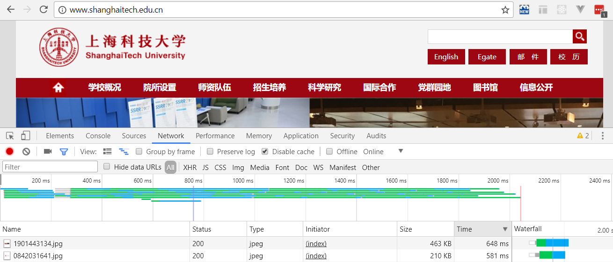
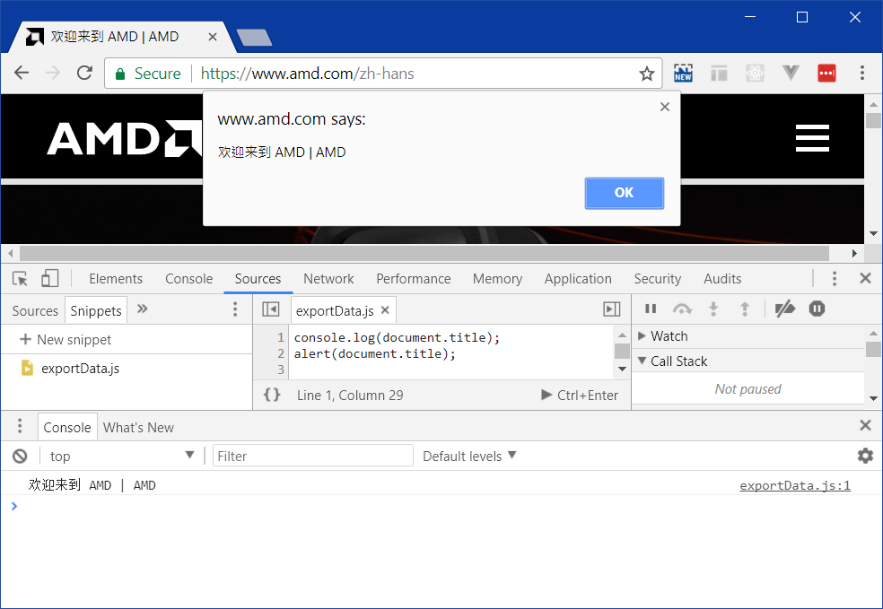

第5周 实验0

浏览器开发者工具
==============

> **版本提示** 本次实验指南基于英语版本的 Chrome 62 编写。

在大多数现代浏览器中，只要在浏览界面下按 <kbd>F12</kbd> 键，就能够开关（toggle）开发者工具。

如果你用过 IDE，那你就会对开发者工具感到十分熟悉。在这里，你可以给 JavsScript 打断点、查看运行时间、看运行栈内的变量值……

它也可以让你直接操作 DOM 内的元素，但是请不要利用它的这个能力做违背诚信和道德原则的事。比如篡改某些不在后台记录成绩的评测平台的打分页面上展示的成绩。

> **题外话** 某些能力欠缺的时候，最好的做法是承认自己能力欠缺，然后评估是要改进这方面的能力，还是要发展自己其他更擅长培养的能力，使得这个欠缺对未来的你而言无关紧要。

主要学习资料
-----------

熟悉的同学可以直接完成思考题部分。

不太熟悉的同学，请大家跟着 [Chrome DevTools 中文手册](https://leeon.gitbooks.io/devtools/content/learn_basic/overview.html) 探索具体的使用流程。

当然，有条件的同学可以直接访问 [Google Web 开发者社区](https://developers.google.com/web/tools/chrome-devtools/?hl=zh-cn) 的相应内容。

思考题
------

### 瀑布怎么流
打开 Network 工具，仔细看看你的浏览器加载 [我们自己学校官网的首页](http://www.shanghaitech.edu.cn) 涉及多少 HTTP 请求？看完之后，你可以感受一下 [西交利物浦学校官网首页](http://www.xjtlu.edu.cn/zh/) 的轻、快、漂亮。

注意资源列表的表头是支持单击排序的，你很轻松就能找到传输时间最长的图是哪一张。



### 临时变卦
> **注意** 其实并没有人知道到底应该写 `Geek Pie` 还是 `GeekPie` 还是 `GeekPie_`。

假设你在有网的地方加载了 Geek Pie 官网首页进行展示，然后你收到了文涛十万火急的一条短信，说要官网很久没更新的社团名字是错的，希望你在展示给合作企业的适合不要搞出宣传上的偏差。

使用 Element 工具，在 DOM 树中找到相应位置进行修改，让 Geek Pie 官网首页的标题部分看起来像是这样


> 提示：单纯的双击修改可能没有办法达到增加换行这个效果，你可能要用到鼠标右键菜单中的 Edit as HTML 功能

### 真的没有 PS 痕迹
在 [AMD 官网](https://www.amd.com/zh-hans) 的相应位置上直接单击鼠标右键，使用 Inspect（或直接键盘快捷键 <kbd>Ctrl</kbd>+<kbd>Shift</kbd>+<kbd>I</kbd>）功能快速修改官网首页广告的内容。

> **注意** 自己开开玩笑可以，不要用来造谣！


### 带着自己的 JS 工具包
“玩转”（play around）Sources 工具内的 Snippets，尝试打个断点，或者玩一玩`console.log`和`alert`……



思考一下下面哪段代码比较适合在冬天跑起来，然后用电脑来摊荷包蛋。（出于节省能源的考虑，**不要**真的随便丢进去跑！）

```js
while (true) {
    alert('关掉我呀');
}
```

```js
while (true) {
    for (let i=0, i<3, i++) {
        console.log('好饿');
    }
    console.log('我真的好饿');
}
```
